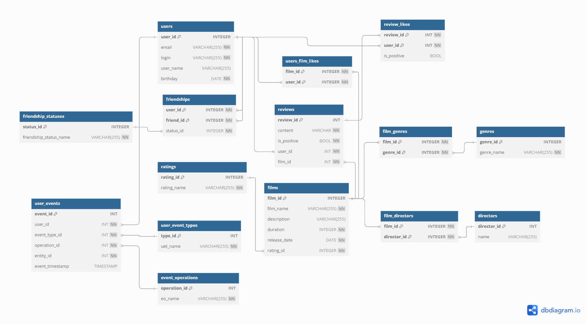

# java-filmorate
### Диаграмма БД
  
В реализованной БД названия полей **name** отличаются от тех, что на диаграмме.  
- Для таблицы users: name -> **user_name** 
- Для таблицы friendship_statuses: name -> **friendship_status_name** 
- Для таблицы films: name -> **film_name**
- Для таблицы ratings: name -> **rating_name**
- Для таблицы genre: name -> **genre_name**